# Part 1: The Only Part
## Task 1: Getting Intentional

### **Task 1a: What's the difference?**
1) What are the two types of Intents? 
A - There are two types of intents in android - Implicit and Explicit intents.

2) Which of the two types of Intents is more secure? 
A - Explicit intent is more secure because here a target component/activity is specified in the code. Therefore, only that component/activity will be invoked. Whereas, an implicit intent specifies an action that can invoke any app on the device able to perform the action.

3) What type of Intent is shown on lines 69 to 73 of SecondFragment.kt? 
A - Implicit intent because it does not specify the specific activity to be invoked.

4) What type of Intent is shown on lines 68 to 70 of ThirdFragment.kt? 
A - Explicit intent because it specifically invokes the ProductScrollingActivity.

5) Between #4 and #5, which incorporates the more secure technique for implementing an Intent? 
A - ThirdFragment.kt because it implements an explicit intent.

### **Task 1b: Switching Intents**

Since the SecondFragment.kt file uses implicit intent, we made changes to that file and changed the intent from implicit to explicit. In order to do so, we commented out the lines 69 to 73 and added the lines highlighted in the below image. These lines specifically call the ProductScrollingActivity from our own app to browse the cards. This way, no other app on the phone will be invoked in order to perform this function, thus securing our application.

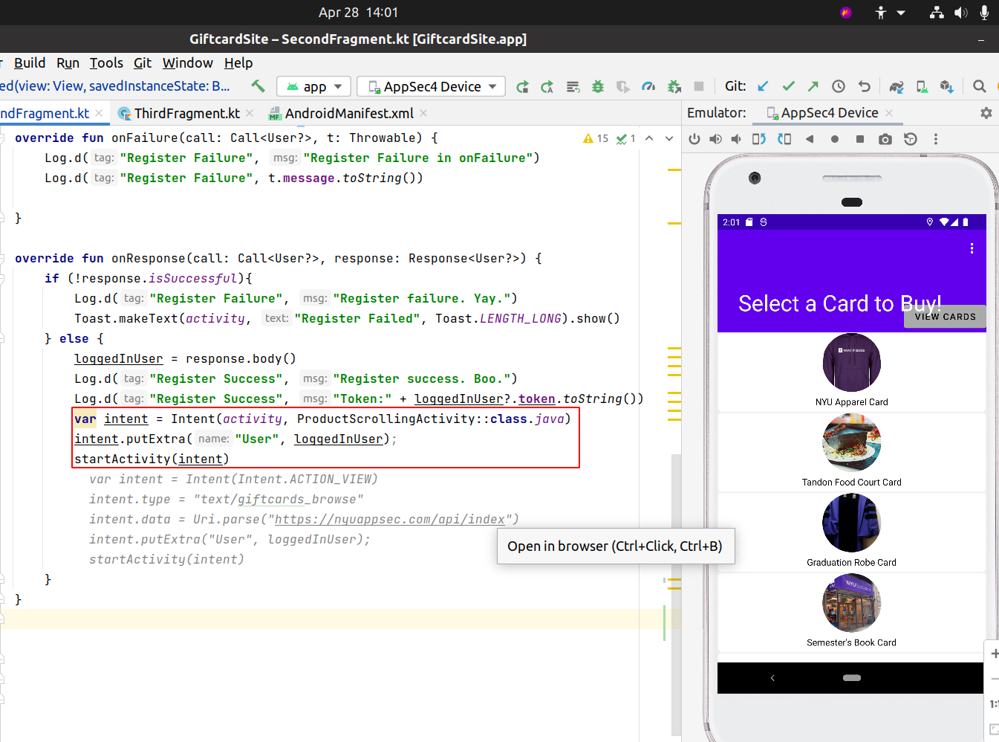

### **Task 1c: Shutting Out The World**

In order to stop other apps from using intents to launch the activities of our application we can use the `android:exported` attribute of the activities. If this field is set to false, the activity will only be able to be launched by the components of the same application.

However, in order to achieve this, we need to remove the intent filters. This is because intent filters are used to allow activities of your app to interact with other applications in a restricted way which is exactly opposite to what the `android:exported="false"` achieves.

In the below image we have added the attribute and commented out the intent filters from all the activities except the MainActivity. This is because the MainActivity needs to be exported in order to be launched by the android launcher.

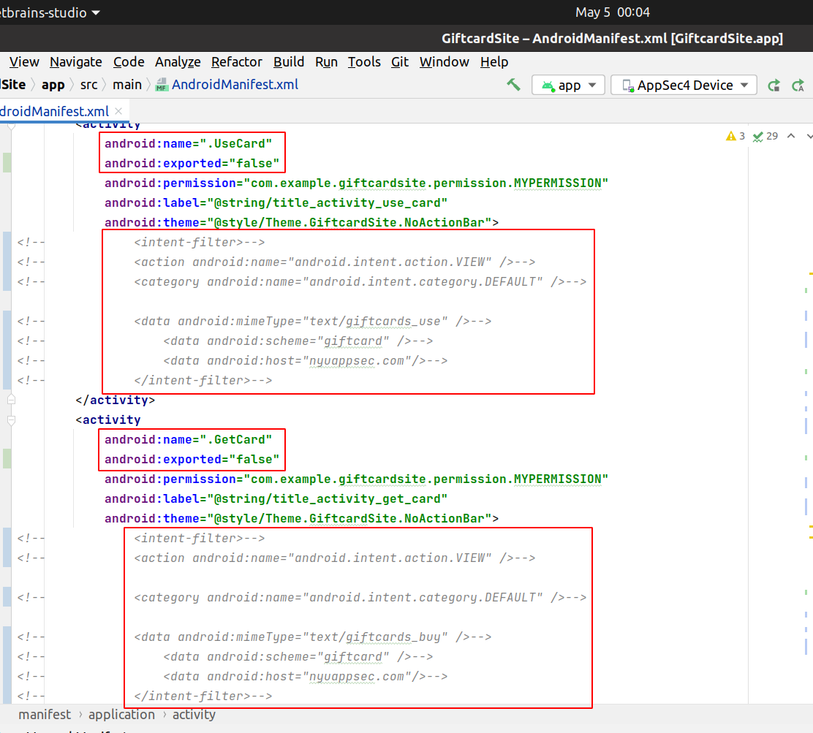

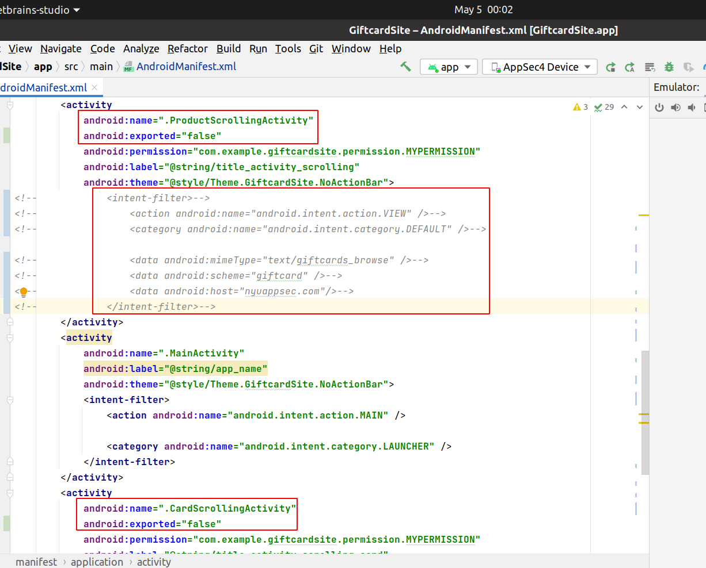

In order to further secure our application and cut off the outside world, we can use the permission tag in the AndroidManifest.xml file. It declares a security permission that can be used to limit access to specific components or features of applications.

In the image below, the first line defines the protection level. It indicates the procedure the system should follow when determining whether or not to grant the permission to an application requesting it. In our case, we set the protection level to "signature". This tells the system to grant permission to the activities only if requesting application is signed with the same certificate as the application that declared the permission. If the certificate matches the system will automatically grant the permission. In the second line we give a name to our permission that will be specific to our own app. In the third line, we specify that our app uses the permission mentioned above.

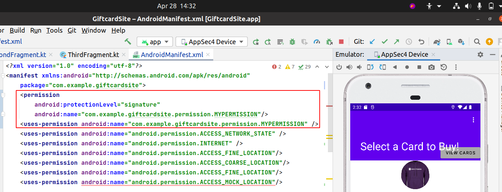

In the below two images, we add the android:permission tag to all the activities in the AndroidManifest.xml except the MainActivity. By declaring this, only our app will be able to call these activities. No other app will be able to do so because that app will not be using the same permission as our app. 

Here, we leave out the MainActivity because if we add permission to that activity, our launcher will not be able to open the home screen of our app. Hence we do not add the permission tag to the main activity.

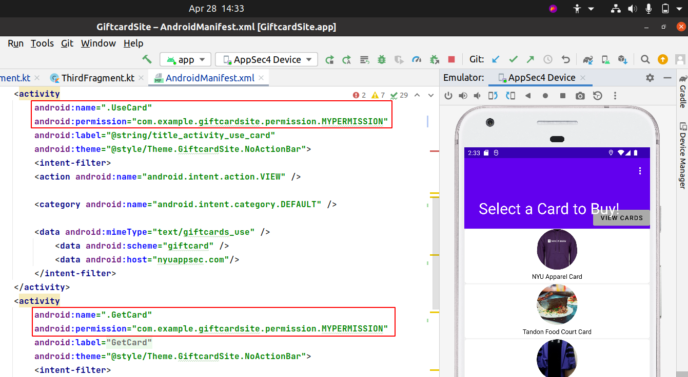

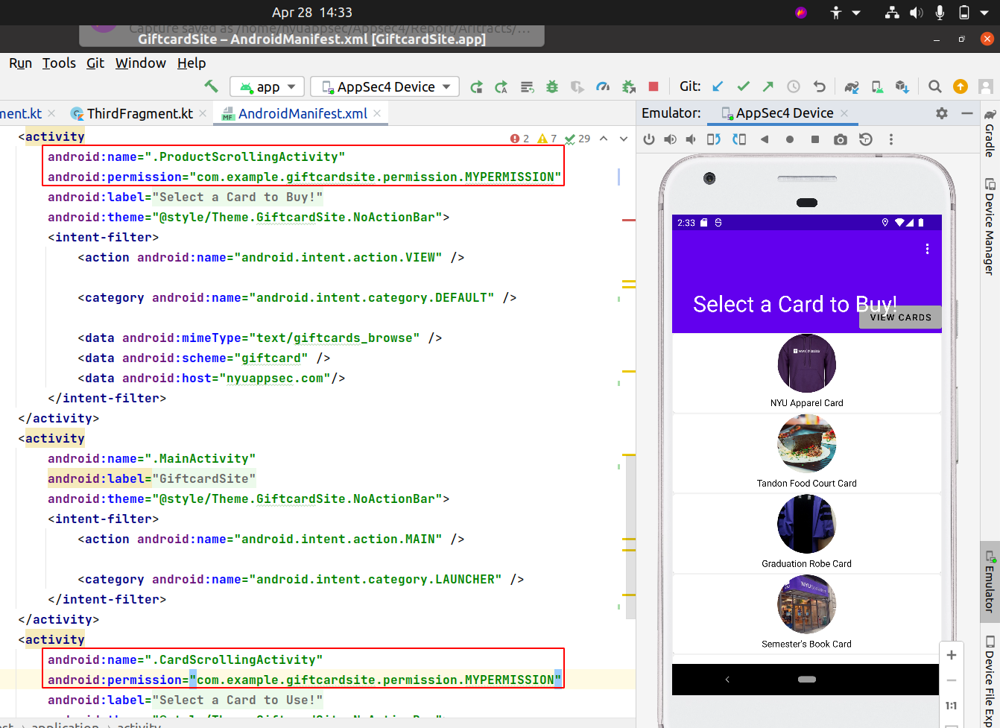

## Task 2: Stoppin' the Eavesdroppin'

In order to make the communication secure, it is mandatory we use the HTTPS protocol in our applications. Hence, we modify all the mentioned files in change all the places where `http://nyuappsec.com` was being called to `https://nyuappsec.com`

After making the changes and proxying the traffic we can see that our app now uses the https protocol to communicate with the server.

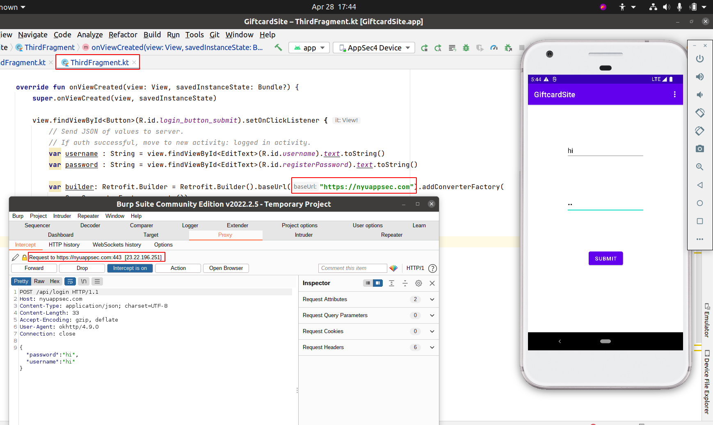

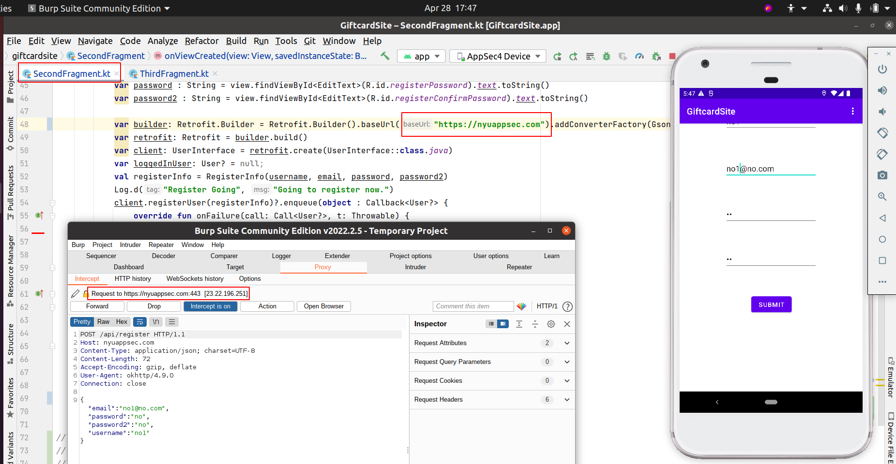

## Task 3: Oops! Was that card yours?

### **Task 3a**

Here, in order to find out the vulnerable end point, we take the following steps:
- Setup our device to proxy traffic through Burp.
- Buy 1 giftcard and use it.
- The 1st image shows the call the application makes to /api/use/44 end point. We can also see the it uses a PUT request method.
- The number 44 looks like some sort of identification number for the giftcard.
- We then send our intercepted request to the repeater and try changing the number at the end of the api call and see what happens.
- After we forward our intercepted request, our user is left with 0 cards.
- However, in the 2nd image we can see that on changing the call to '/api/use/1' and sending the request, we can see that it succeeds.
- This shows that we even when our user did not have a card, we were able to use a card that did not belong to our user.

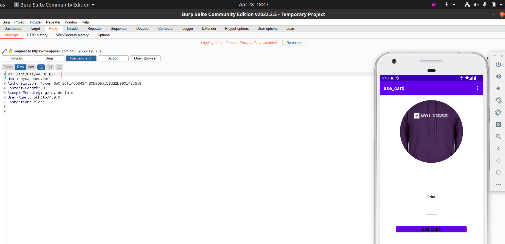

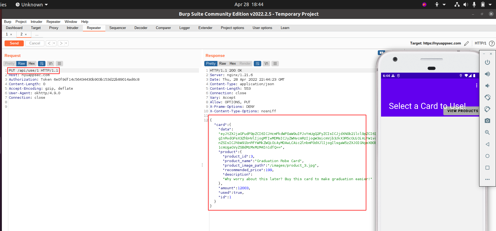

Upon decoding the data in the server response we can see the customer id of the user whom the card belonged to.

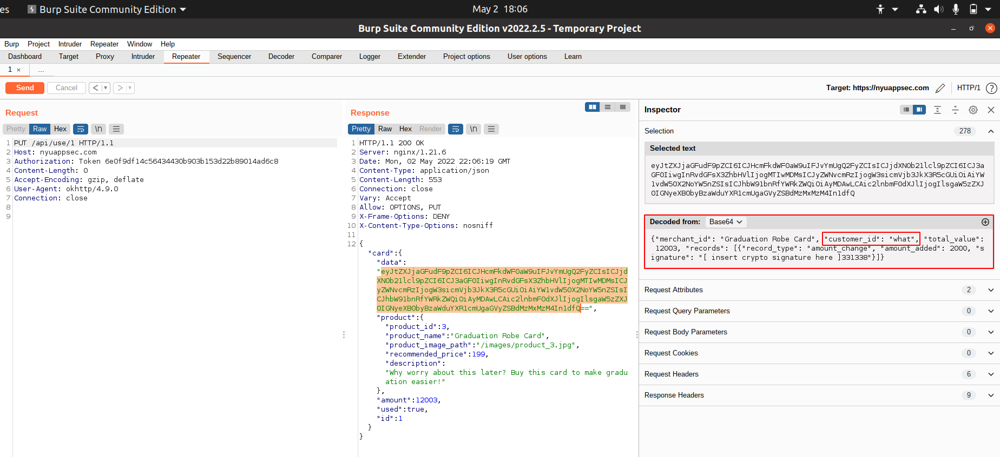

### **Task 3b**

On the application side, the issue is the PUT request used in order to use the card. This can potentially allow the user to modify a card, create a new card or use an existing one repeatedly. Here the PUT request should be replaced with a GET/POST request.

On the server side, there is no validation that whether the card the belong to the user or not. There should be a check that would match the customer_id with the id of the logged in user. There is also no validation whether the card being used has been previously used or not. This validation can be implemented by either checking a field in the card being used or another option could be maintaining 2 different databases - 1 for unused cards and 1 for used cards. Every time a user tries to use a card, the sever can fetch the card from the unused card database and perform a validation if the card belongs to the user. After the card has been used, it can delete the entry from the unused card database and store it in the used card database. If there was a error fetching the card from the unused card database, the application will know that either the card does not exist or it has been already used.

Implementing the above changes can help us remediate the vulnerability.

# Task 4: Please Hold... Your Privacy Is Very Important To Us!

### **Task 4a**

In order for our application to function we only need 1 permission - INTERNET. The permission as the name suggests is required to access the internet on the phone.

We do not need the NETWORK_STATE because it is redundant. This is because the NETWORK_STATE permission only gathers information about the state of the network and service provider, etc. Because we request for the INTERNET permission, if it fails, it will anyway throw an error hence we do not need any information about the state of the network.

FINE_LOCATION permission is used to get the exact location of the user. Our application only needs to know the region of the user in order to serve him better, his exact location is not necessary for the app to be functional. Hence we can remove this permission.

COARSE_LOCATION is used to get an approximate location of the user. This is also not required because our app does not have different servers where we direct user traffic to different servers based on the location.

MOCK_LOCATION is used by developers for testing purposes. It is insignificant to have in a production application.

In order to remove the location permission we also had to edit the CardScrollingActivity and the ProductScrollingActivity files and comment out the lines highlighted below.

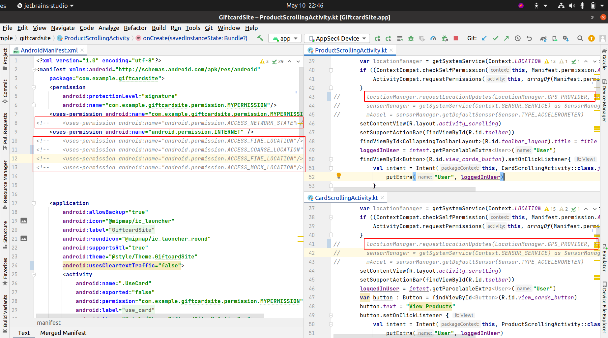

### **Task 4b**

The `UserInfo.kt` file pointed to the `UserInfoContainer.kt` file that used three collection metrics - location, sensor data and token. Here, the token is generated by the application itself for identification purposes and hence can be kept in the application as it does not infiltrate with user privacy.

The other two metrics - location and sensor data are unnecessary and never used in the application. They are not integral to the functioning of our application and hence can be removed.

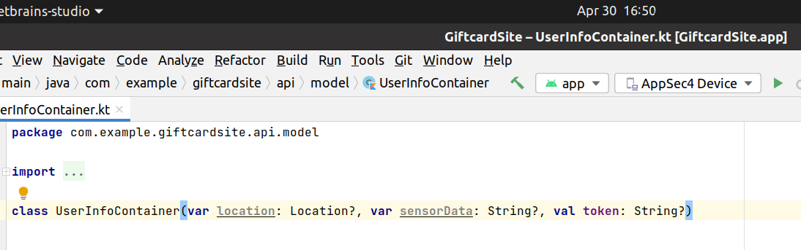

In the images below we can see the application traffic before and after remove the collection metrics from the application.

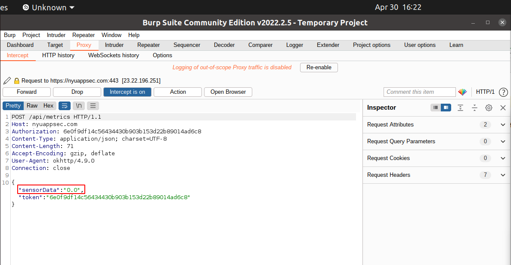

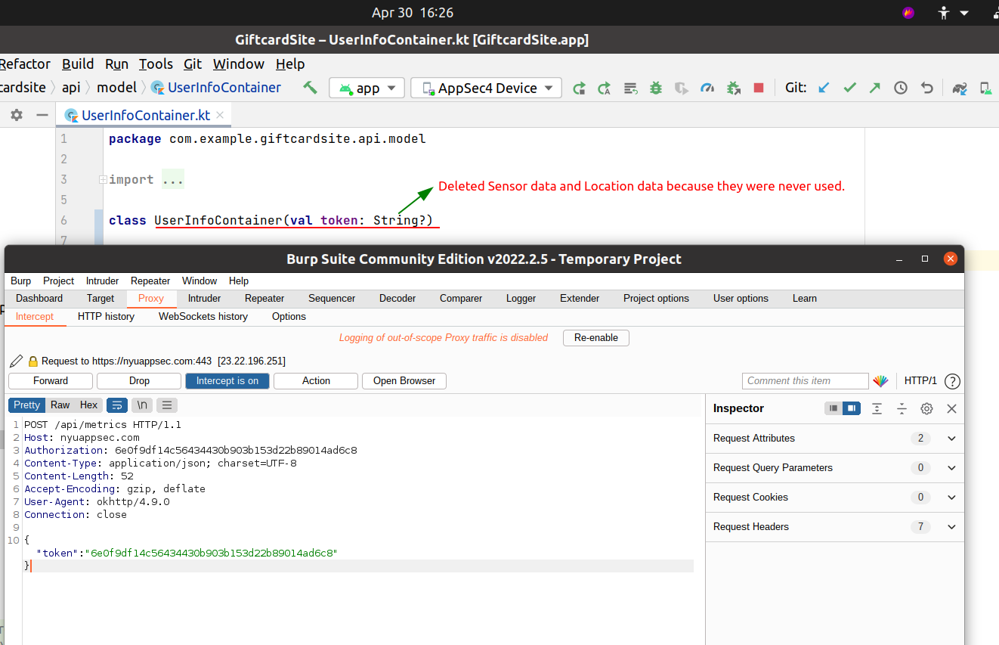

### **Task 4c**

The files CardScrollingActivity and ProductScrollingActivity had unnecessary interactions. These interactions did not affect the functioning of our app in any way and thus were not required.

Below images highlights the lines that were commented out in order to remove the sensor interactions. One change that is not highlighted is the removal of the sensorManager from the class definition.

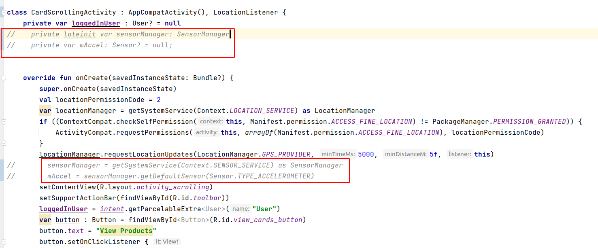

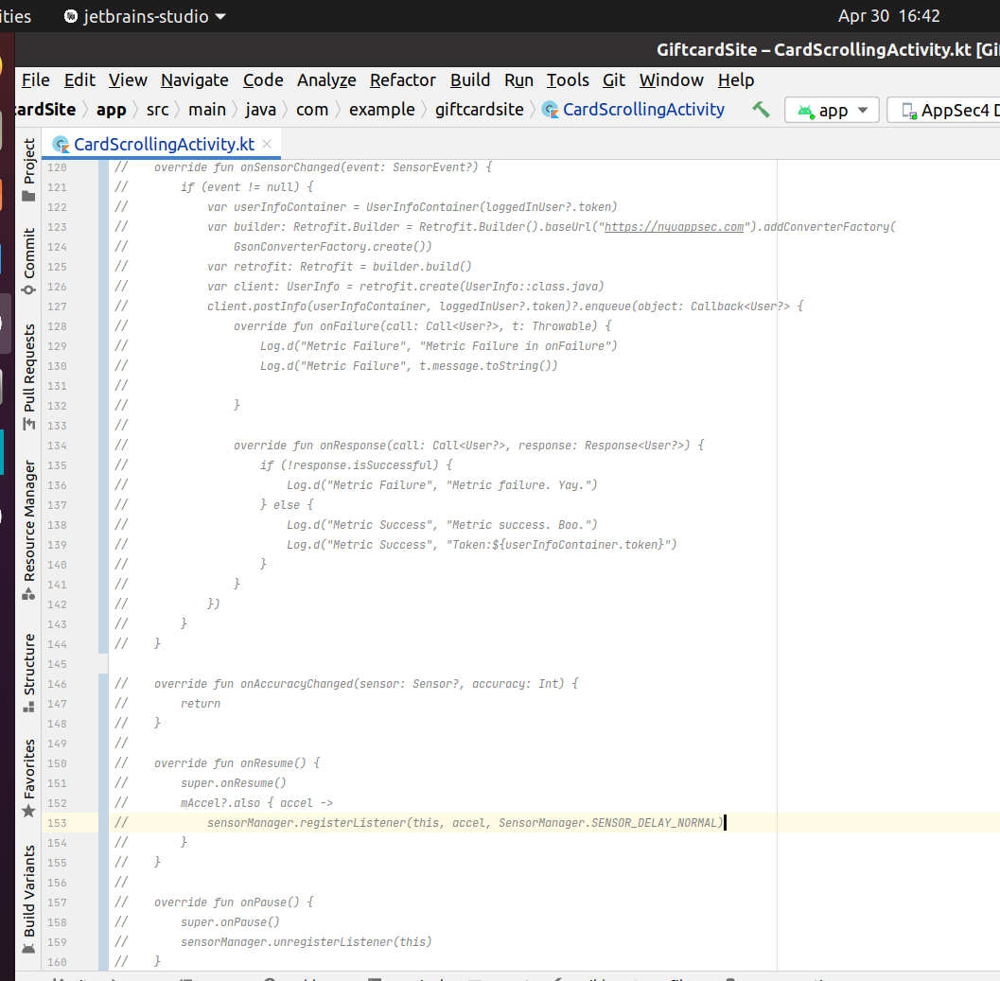

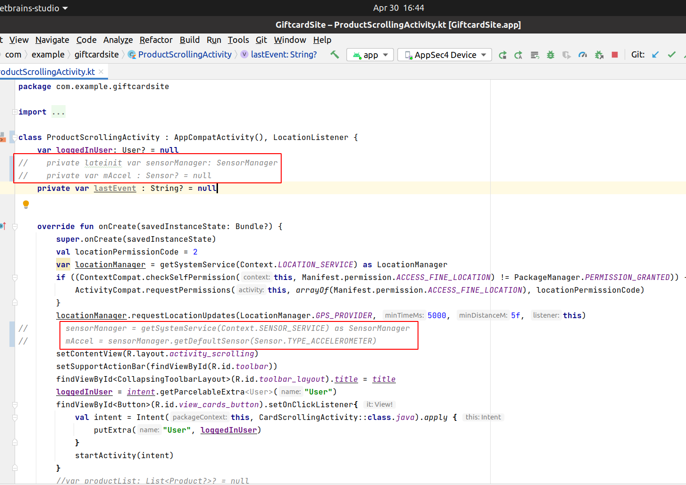

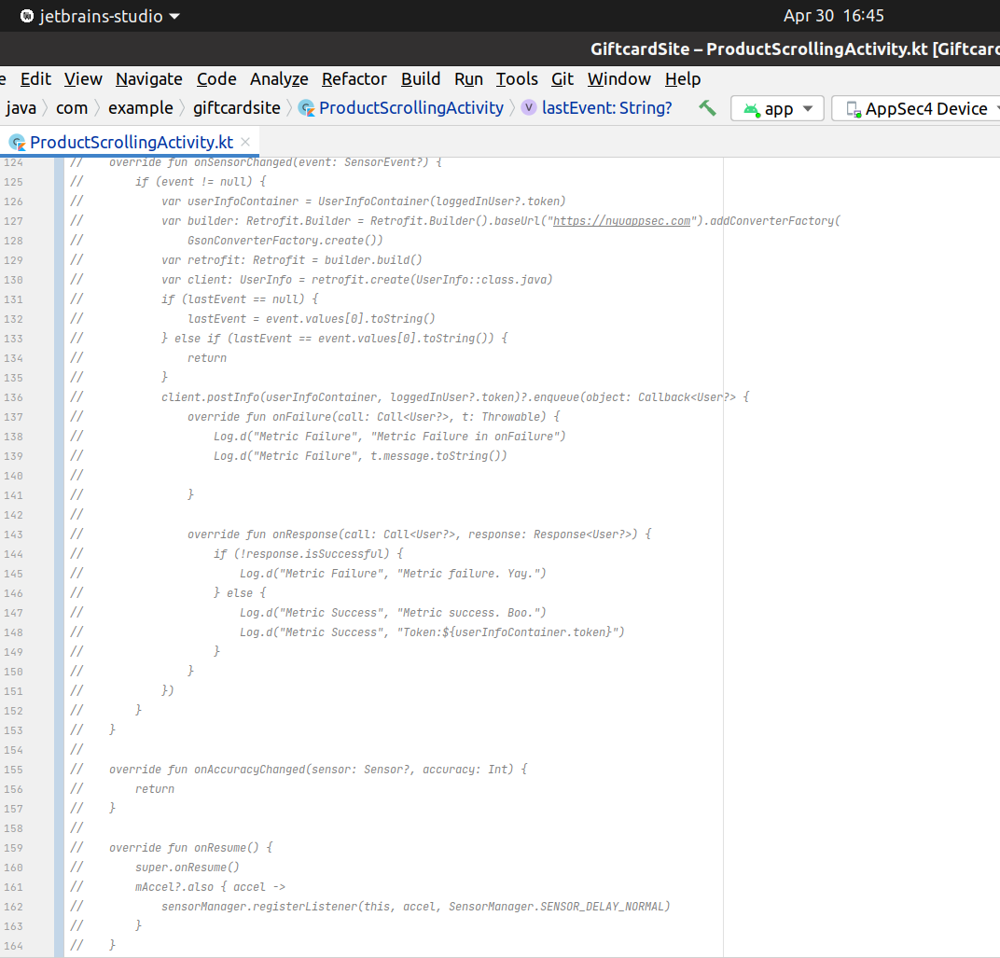

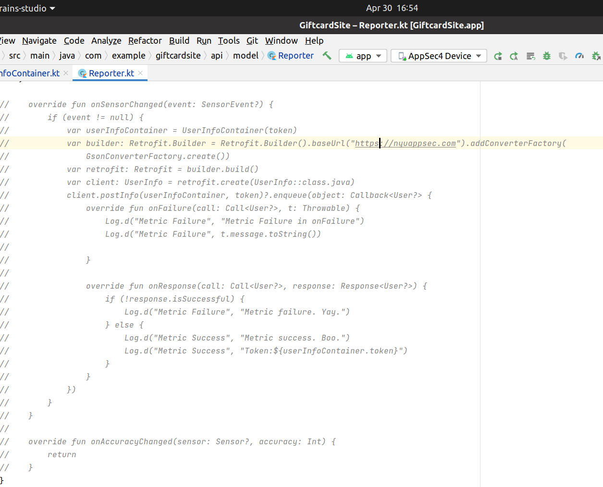
